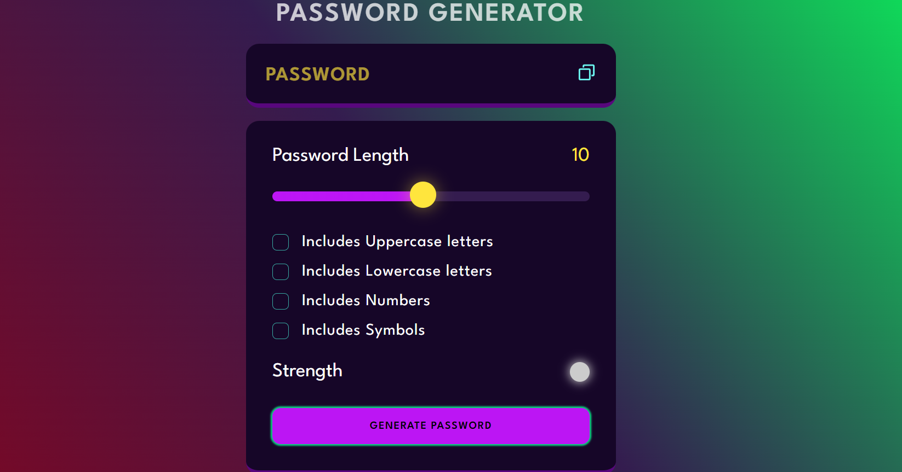

## Password-Generator
***Simulation Link: https://anandkumarprajap.github.io/Password-Generator/***

# OverView
The Password Generator is a web application that allows users to create secure, random passwords based on their chosen criteria. The application is built using HTML for the structure, CSS for styling, and JavaScript for the logic and interactivity.
Features:
Customizable Criteria: Users can specify the length of the password and choose to include or exclude certain types of characters such as:
Uppercase letters
Lowercase letters
Numbers
Special characters
## Preview

